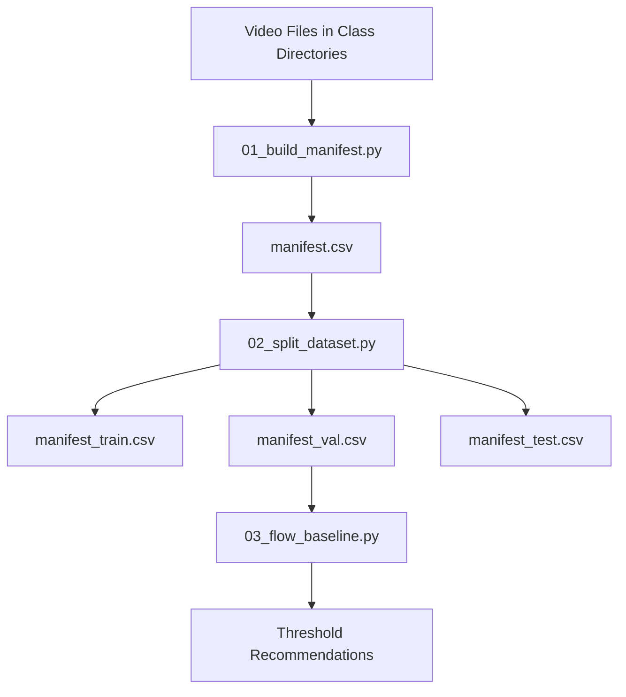

# Dataset Processing Pipeline

This directory contains the scripts for processing video datasets for dog coprophagy detection. The scripts should be run in the following order:

## 1. Build Manifest (`01_build_manifest.py`)

**Purpose**: Creates a comprehensive manifest file that catalogs all video files in your dataset.

**What it does**:
- Scans the dataset directory for video files organized by class labels
- Extracts metadata (duration, file paths, labels) for each video
- Generates a CSV manifest file with all video information
- Attempts to read duration data from existing metadata files (if available)

**Inputs**:
- Video files organized in subdirectories by class (e.g., `poop/`, `not_poop/`, `coprophagy/`)
- Optional: `metadata_out.csv` file with pre-computed video durations

**Outputs**:
- `manifest.csv`: CSV file containing paths, labels, and durations for all videos

**Configuration** (via .env):
- `DATASET_PATH`: Root directory containing the processed dataset
- `CLASSES`: Comma-separated list of class names
- `MANIFEST_FILENAME`: Output manifest filename
- `METADATA_FILENAME`: Input metadata filename
- `VIDEO_EXTENSION`: File extension for video files (e.g., ".mp4")

## 2. Split Dataset (`02_split_dataset.py`)

**Purpose**: Splits the complete dataset into training, validation, and test sets with reproducible random sampling.

**What it does**:
- Reads the manifest file created by the previous script
- Performs stratified splitting to maintain class balance across splits
- Uses configurable split ratios for train/validation/test
- Ensures reproducible results with configurable random seed

**Inputs**:
- `manifest.csv`: Complete dataset manifest from step 1

**Outputs**:
- `manifest_train.csv`: Training set manifest
- `manifest_val.csv`: Validation set manifest
- `manifest_test.csv`: Test set manifest

**Configuration** (via .env):
- `DATASET_PATH`: Root directory containing the processed dataset
- `MANIFEST_FILENAME`: Input manifest filename
- `RANDOM_SEED`: Random seed for reproducible splits
- `TRAIN_SPLIT`, `VAL_SPLIT`, `TEST_SPLIT`: Split proportions (should sum to 1.0)

## 3. Optical Flow Baseline (`03_flow_baseline.py`)

**Purpose**: Performs optical flow analysis on validation videos to establish baseline motion detection parameters.

**What it does**:
- Analyzes video frames using optical flow to detect motion patterns
- Calculates "stillness ratios" and activity durations for each video
- Performs grid search to find optimal thresholds for motion-based classification
- Suggests configuration values for the main Ellie Watcher application

**Inputs**:
- `manifest_val.csv`: Validation set manifest from step 2
- Video files referenced in the validation manifest

**Outputs**:
- Console output with optimal threshold recommendations
- Suggested `.env` values for `SQUAT_SCORE_POOP` and `POOP_MIN_DURATION_S`

**Configuration** (via .env):
- `DATASET_PATH`: Root directory containing the processed dataset
- `VAL_MANIFEST_FILENAME`: Validation manifest filename
- `VIDEO_FPS`: Target frames per second for processed videos
- `FLOW_WIN`, `FLOW_LVL`, `FLOW_ITER`: Optical flow computation parameters
- `FLOW_LOW_MAG`, `FLOW_LOW_RATIO_GATE`: Motion detection thresholds

## Workflow Overview



## Prerequisites

1. Install required dependencies:
   ```bash
   pip install -r requirements.txt
   ```

2. Configure your `.env` file with dataset paths and parameters (see `.env.sample` for examples)

3. Ensure your dataset is organized as:
   ```
   ellie_dataset/processed/
   ├── poop/
   │   ├── video1.mp4
   │   ├── video2.mp4
   │   └── ...
   ├── not_poop/
   │   ├── video3.mp4
   │   └── ...
   └── coprophagy/
       ├── video4.mp4
       └── ...
   ```

## Usage

Run the scripts in order:

```bash
cd scripts/process_videos

# Step 1: Build manifest
python 01_build_manifest.py

# Step 2: Split dataset
python 02_split_dataset.py

# Step 3: Analyze optical flow baseline
python 03_flow_baseline.py
```

## Expected Output

After running all scripts, you'll have:
- Complete dataset manifest (`manifest.csv`)
- Split manifests for training/validation/testing
- Recommended threshold values for the main application
- Console output showing dataset statistics and optimal parameters

The threshold recommendations from step 3 should be added to your main `.env` file for the Ellie Watcher application.
